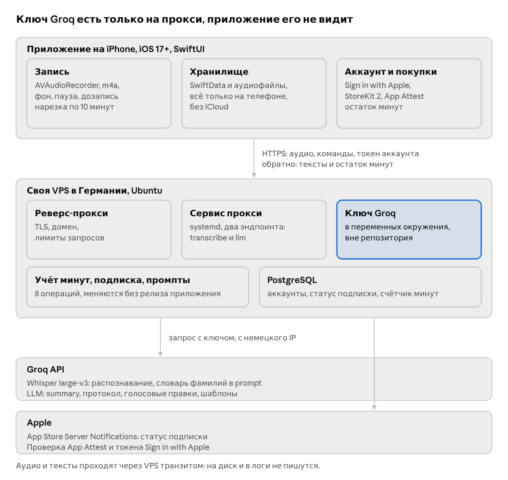

# ТЗ: iOS-приложение для записи и протоколирования встреч

Sep 30, 2026 · @Roman

## 1. Назначение и границы MVP

Приложение записывает встречу на iPhone, превращает её в текст с пунктуацией, делает summary и протокол по шаблону, а всё это можно править голосом. Цель — заменить встроенную диктовку iOS, которая плохо распознаёт русский и не ставит знаки препинания.

Целевой пользователь — руководитель, который проводит много встреч и рассылает итоги коллегам. Распространение — App Store, по подписке. Интерфейс и промпты по умолчанию на английском, русский поддерживается наравне.

В MVP входит:

- запись с паузой и дозаписью в конец;
- транскрибация через Groq Whisper после остановки записи, язык распознавания определяется автоматически;
- автоматическое summary и описание записи;
- протокол по шаблону, библиотека шаблонов;
- хайлайты одного универсального типа, ставятся постфактум;
- голосовая и ручная правка транскрибации, summary и протокола;
- локальная история записей, копирование и системный шаринг.

В MVP не входит: транскрибация в реальном времени, перемотка с перезаписью с середины, синхронизация через iCloud, разделение по спикерам, отметки во время записи.

## 2. Режимы и сценарии

У приложения два явно разделённых режима, и приложению никогда не нужно угадывать, диктуешь ты или командуешь.

| Режим | Как войти | Что означает речь | Результат |
|---|---|---|---|
| Запись встречи | Кнопка «Запись» на главном экране или «Дозаписать» в карточке записи | Содержание встречи | Аудио добавляется в конец записи, после стопа идёт транскрибация |
| Правка | Кнопка «Править» в карточке записи | Команда на изменение текста | LLM применяет команду к выбранному тексту: транскрибации, summary или протоколу |

Основные сценарии:

1. Записать встречу. Старт, при необходимости пауза и продолжение, стоп. Через несколько секунд видишь транскрибацию, summary и описание.
2. Дозаписать. Открыл запись, нажал «Дозаписать», сказал. Новый фрагмент транскрибируется и приклеивается в конец, summary пересобирается.
3. Поправить голосом. Нажал «Править», сказал «замени Курбацкий на Курбатский везде» или «сократи summary до трёх пунктов». Видишь результат с подсветкой изменений и кнопкой «Отменить».
4. Отметить хайлайты. В транскрибации выделил фрагмент пальцем и нажал «Хайлайт» либо в режиме правки сказал «отметь момент про сроки поставки».
5. Сделать протокол. Кнопка «Протокол» по шаблону по умолчанию или команда «сделай протокол по шаблону встречи с заказчиком». Хайлайты попадают в отдельный блок «Ключевые моменты».
6. Отправить. Скопировать или поделиться транскрибацией, summary или протоколом.

## 3. Функциональные требования

### 3.1. Запись

- Старт, пауза, продолжение, стоп. Таймер и индикатор уровня звука на экране.
- Запись продолжается при заблокированном экране и в фоне (фоновый режим audio).
- Входящий звонок или Siri ставят запись на паузу, после них запись предлагает продолжить.
- Формат: AAC в m4a, моно, 16 кГц, около 32 кбит/с. Час встречи весит примерно 15 МБ.
- Дозапись в существующую запись создаёт новый аудиофрагмент; фрагменты хранятся по порядку.

### 3.2. Транскрибация

- После стопа аудио уходит через прокси в Groq, модель whisper-large-v3, язык определяется автоматически, при необходимости задаётся вручную в настройках.
- Длинные записи режутся на куски примерно по 10 минут с перекрытием в несколько секунд, куски склеиваются по порядку.
- В поле prompt Whisper передаётся словарь: фамилии и термины пользователя. Это заметно улучшает распознавание имён.
- При ошибке сети запись остаётся с исходным аудио и статусом «Не распознано», есть кнопка «Повторить».

### 3.3. Summary и описание

- Вторым запросом к LLM генерируются описание в одну строку (для списка истории) и summary.
- Summary редактируется голосом и руками; можно пересобрать из транскрибации.

### 3.4. Хайлайты

- Один универсальный тип. Ставятся только постфактум.
- Способы: выделить фрагмент пальцем и нажать «Хайлайт» либо голосовой командой в режиме правки.
- Хайлайт хранится как диапазон в транскрибации плюс цитата; подсвечивается в тексте и попадает в протокол блоком «Ключевые моменты».

### 3.5. Протокол и шаблоны

- Протокол генерируется из транскрибации, summary и хайлайтов по выбранному шаблону.
- Шаблон по умолчанию встроен (раздел 7), его можно менять.
- Библиотека шаблонов: создать, назвать, изменить, удалить, выбрать шаблон по умолчанию.
- Новый шаблон: базу надиктовать, тонкую правку сделать руками в текстовом редакторе.
- Переключение шаблона голосом: «сделай протокол по шаблону встречи с заказчиком». LLM сопоставляет название с библиотекой; если совпадение неоднозначно, приложение переспрашивает.

### 3.6. Голосовая правка

- В режиме правки выбирается цель: транскрибация, summary или протокол (по вкладке, которая открыта).
- Команда записывается, распознаётся Whisper и отправляется в LLM вместе с текстом-целью.
- Для транскрибации LLM возвращает список точечных замен в JSON, приложение применяет их локально. Длинный текст целиком не переписывается: это дешевле и не портит остальной текст.
- Для summary и протокола LLM возвращает новый текст целиком.
- После правки видна подсветка изменений; действует «Отменить» с историей из нескольких шагов.
- Ручное редактирование доступно всегда.

### 3.7. История

- Список записей, новые сверху: дата, время начала, длительность, описание.
- Поиск по тексту транскрибаций и описаниям.
- Удаление записи удаляет аудио и все тексты.

### 3.8. Экспорт

- Копировать в буфер и системный шаринг для транскрибации, summary и протокола.
- Протокол отдаётся как текст с простой разметкой, чтобы нормально вставлялся в почту и мессенджеры.

## 4. Экраны

Пять экранов; навигация через NavigationStack, без таббара.

| Экран | Что на нём | Главные действия |
|---|---|---|
| История (главный) | Список записей, поиск, большая кнопка записи внизу | Начать запись, открыть запись, удалить свайпом |
| Запись | Таймер, уровень звука, статус | Пауза, продолжить, стоп |
| Карточка записи | Вкладки: Транскрибация, Summary, Протокол; сверху дата, длительность, описание | Править, Дозаписать, Хайлайт, Протокол, Копировать, Поделиться, Отменить |
| Шаблоны | Список шаблонов, отметка шаблона по умолчанию | Создать голосом, открыть, удалить, сделать по умолчанию |
| Редактор шаблона | Название и текст шаблона | Править руками, дополнить голосом, сохранить |

Плюс служебные: онбординг с согласием на отправку данных в AI-сервис (раздел 8), настройки со словарём фамилий и терминов, ссылкой на политику конфиденциальности и удалением всех данных.

Режим правки не отдельный экран, а состояние карточки записи: кнопка «Править» превращается в большую кнопку удержания или нажатия, над текстом виден статус «Слушаю / Применяю».

## 5. Архитектура

Приложение знает только адрес своего прокси; всё распознавание и генерация идут через Groq, а ключ хранится в переменных окружения сервиса на сервере, вне репозитория.



У прокси два эндпоинта: POST /v1/transcribe принимает аудиофрагмент, POST /v1/llm принимает тип операции из раздела 7 и данные. Аудио и тексты проходят транзитом: прокси не пишет содержимое ни в базу, ни в логи. Постоянно на сервере живут только учётные записи и счётчики минут, они лежат в PostgreSQL на той же машине.

Клиент устроен по слоям: SwiftUI-экраны, сервис записи на AVAudioSession и AVAudioRecorder, сервис API с очередью отправки и повторами, хранилище на SwiftData. Сторонних библиотек нет.

## 6. Модель данных

Хранение локальное: SwiftData для структур, аудио файлами в папке приложения. Минимальная версия iOS 17.

| Сущность | Поля | Заметки |
|---|---|---|
| Recording | id, startedAt, duration, title, transcript, summary, protocol, templateId, status | status: recording, transcribing, ready, failed |
| AudioSegment | id, recordingId, order, fileName, duration, transcript | Один сегмент на каждую дозапись; транскрибация сегмента хранится отдельно |
| Highlight | id, recordingId, rangeStart, rangeEnd, quote, createdAt | Диапазон по полной транскрибации; цитата страхует от сдвигов после правок |
| Template | id, name, body, isDefault, createdAt | body — описание структуры протокола в Markdown |
| EditStep | id, recordingId, target, before, after, command, createdAt | Для «Отменить»; хранится последние 20 шагов на запись |
| Glossary | term | Фамилии и термины для подсказки Whisper и LLM |

Полная транскрибация записи — склейка транскрибаций сегментов по order. После ручной или голосовой правки она сохраняется в Recording как отредактированная версия, исходные тексты сегментов не трогаются.

## 7. Промпты и шаблон протокола

Все промпты живут на прокси, а не в приложении: так их можно менять без релиза в App Store. Клиент передаёт только тип операции и данные.

| Операция | Вход | Выход |
|---|---|---|
| transcribe | Аудиофрагмент, словарь | Текст |
| summarize | Транскрибация, словарь | JSON: title (до 60 символов), summary |
| protocol | Транскрибация, summary, хайлайты, текст шаблона, дата | Протокол в Markdown |
| edit_transcript | Команда, транскрибация | JSON: список замен {find, replace, all} |
| edit_text | Команда, summary или протокол | Новый текст целиком |
| highlight | Команда, транскрибация | JSON: цитата для выделения |
| pick_template | Команда, названия шаблонов | JSON: id шаблона или список кандидатов |
| draft_template | Надиктованное описание | Шаблон в Markdown |

Общие правила для LLM: ничего не придумывать сверх транскрибации; если в тексте нет данных для раздела, писать «не обсуждалось»; фамилии и термины брать из словаря; отвечать на языке транскрибации, а если он не определился — на языке интерфейса.

Шаблон протокола по умолчанию существует в двух версиях, английской и русской; приложение выбирает версию по языку транскрибации. Русская версия:

```markdown
# Протокол встречи: {тема}

Дата: {дата}
Длительность: {длительность}
Участники: {перечислить по упоминаниям в разговоре}

## Повестка
- {темы, которые обсуждались, по порядку}

## Обсуждение
{по каждой теме 2–4 предложения: позиции сторон, аргументы, цифры}

## Ключевые моменты
- {хайлайты пользователя, дословно или близко к тексту}

## Решения
1. {принятое решение}

## Задачи
| Задача | Ответственный | Срок |
|---|---|---|
| {что сделать} | {кто} | {когда или «не определён»} |

## Открытые вопросы
- {что осталось нерешённым}

## Следующая встреча
{дата и тема, если договорились}
```

## 8. Требования App Store

Главное для ревью — явное согласие пользователя до первой отправки аудио в сторонний AI-сервис и честно заполненная карточка App Privacy.

- Согласие. При первом запуске экран: какие данные уходят (аудио и тексты), куда (наш сервер и Groq как обработчик), зачем (распознавание и генерация протокола). Кнопки «Согласен» и «Не сейчас»; без согласия запись работает, отправка нет. Правила App Store требуют такого раскрытия и разрешения при передаче персональных данных стороннему AI.
- Info.plist: NSMicrophoneUsageDescription с понятным текстом; UIBackgroundModes = audio для записи с заблокированным экраном.
- PrivacyInfo.xcprivacy: отключённое отслеживание, собираемые типы данных, причины для required reason API (UserDefaults, даты файлов).
- App Privacy в App Store Connect: Audio Data и Other User Content, цель App Functionality; плюс User ID и Purchase History для аккаунта и подписки, связанные с личностью. Отслеживания нет.
- Политика конфиденциальности по публичной ссылке: что отправляется, что аудио и тексты не хранятся на сервере, что хранится учётная запись и счётчик минут, Groq как обработчик, контакт для запросов.
- Удаление данных: в настройках кнопка «Удалить все данные» и отдельная кнопка удаления аккаунта, обязательная для приложений с входом. Удаление аккаунта стирает записи на устройстве и счётчик минут на прокси.
- Для ревьюера: прокси должен работать в момент ревью; в заметках к сборке описать, как проверить запись и протокол.
- Ключ Groq в приложении не хранится ни в каком виде.

## 8а. Монетизация

Модель — ежемесячная подписка с лимитом минут распознавания. Разовая покупка не подходит: расходы на Whisper и LLM повторяются каждый месяц, своих мощностей нет.

- Auto-renewable subscription через StoreKit 2, помесячно. Один или два тарифа, различаются лимитом минут в месяц.
- Бесплатный порог на пробу: несколько десятков минут. Без подписки запись и просмотр старых записей работают, отправка на распознавание нет.
- Учёт минут ведёт прокси: он единственный видит фактическое потребление. Клиент показывает остаток, но источник правды не он.
- Аккаунт через Sign in with Apple. Потребление и подписка привязаны к аккаунту, а не к устройству, поэтому при смене телефона остаток и история подписки переезжают. App Attest остаётся защитой прокси от чужих клиентов.
- Проверка подписки: App Store Server Notifications на прокси плюс локальная проверка транзакции в приложении. Прокси отказывает в запросе, если подписка не активна.
- Экраны: вход через Sign in with Apple, пейволл после исчерпания бесплатного порога, остаток минут и управление аккаунтом в настройках, восстановление покупок. Вход требуется только для отправки на распознавание: запись и просмотр истории работают без него.
- Для ревью: описание тарифов, ссылки на условия и политику конфиденциальности на экране покупки, тестовый аккаунт в заметках к сборке.

## 9. Нефункциональные требования

| Требование | Значение |
|---|---|
| Платформа | iOS 17+, iPhone, SwiftUI, Swift 6 |
| Длина записи | До 3 часов |
| Время до готовой транскрибации | До 30 секунд на час записи при нормальной сети (ориентир, проверить на пилоте) |
| Время применения голосовой команды | До 5 секунд |
| Хранение на сервере | Содержимое встреч не сохраняется и не пишется в логи. Хранится только учётная запись: идентификатор Sign in with Apple, статус подписки, счётчик минут |
| Защита прокси | App Attest и лимиты запросов на устройство, ключ Groq в переменных окружения сервиса |
| Офлайн | Запись и просмотр истории работают без сети; отправка встаёт в очередь |
| Язык интерфейса | Английский основной, русский дополнительный; локализация с первого релиза |
| Сторонние зависимости в приложении | Нет, только системные фреймворки |

## 10. Риски и открытые вопросы

| Риск | Что делаем |
|---|---|
| Groq отклоняет запросы из части регионов; запросы к Groq уходят с немецкого IP VPS, а не с устройства пользователя | Проверить на пилоте из России; при отказе включить Smart Placement или вынести прокси на VPS в ЕС |
| Лимит на размер файла у Groq и на тело запроса у веб-сервера | Резать аудио на куски по 10 минут на клиенте |
| LLM додумывает решения и сроки, которых не было | Правило «не обсуждалось» в промптах; ручная проверка протокола перед отправкой |
| Голосовая замена задевает не те места | Точечные замены с подсветкой и «Отменить» |
| Злоупотребление прокси чужими клиентами | App Attest, лимиты, возможность отключить устройство |
| Запись собеседников без их ведома | Напоминание в онбординге предупреждать участников о записи |

Открытые вопросы:

- [ ] Размер бесплатного порога и цена тарифов — определить по фактической себестоимости минуты на пилоте.
- [ ] Какую LLM на Groq брать для summary, протокола и правок — выбрать по пилоту на 3–5 реальных встречах.
- [ ] Название приложения и иконка.

## 11. План работ

Собираем снизу вверх: сначала прокси и распознавание, потом всё, что работает с текстом, в конце требования App Store. Каждый этап заканчивается сборкой, которую можно поставить на телефон.

1. Прокси на своей VPS в Германии (Ubuntu, реверс-прокси с TLS, PostgreSQL): эндпоинты transcribe и llm, ключ Groq в переменных окружения, systemd-юнит и деплой.
2. Приложение: запись с паузой, фоном и прерываниями; сохранение в SwiftData; отправка и показ транскрибации.
3. История, карточка записи с вкладками, копирование и шаринг. Первая рабочая версия для себя.
4. Режим правки: edit_transcript и edit_text, подсветка изменений, «Отменить».
5. Хайлайты, протокол, шаблон по умолчанию.
6. Библиотека шаблонов, создание голосом, выбор шаблона голосом.
7. Словарь фамилий и терминов, дозапись, нарезка длинных записей.
8. Аккаунт и подписка: Sign in with Apple, StoreKit 2 в приложении, учёт минут и проверка подписки на прокси, пейволл, восстановление покупок, удаление аккаунта.
9. App Store: онбординг с согласием, App Attest, privacy manifest, политика, TestFlight, отправка на ревью.
